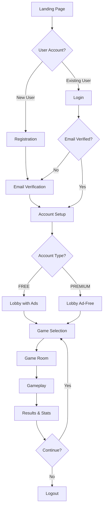

# 🧠 BrainBrawler - Complete UX Experience Guide

## Overview
BrainBrawler is a freemium multiplayer quiz platform that offers different experiences for FREE and PREMIUM users, with monetization through advertisements and premium features.

---

## 📱 User Journey Flow



---

## 🎯 User Experience Journey

### 1. **Landing Page** (`index.html`)
**Purpose**: First impression, user acquisition, conversion

**Features**:
- Modern gradient design with brain theme
- Dual login/registration forms with tab switching
- Real-time validation with debounced availability checks
- Google OAuth integration
- Password strength meter
- Responsive design for all devices

**FREE vs PREMIUM**: No difference at this stage

### 2. **Registration Process**
**Purpose**: Acquire new users with smooth onboarding

**Flow**:
1. **Form Validation**: Real-time username/email availability
2. **Account Creation**: User data stored in database
3. **Email Verification**: 6-digit code sent via SMTP
4. **Welcome Email**: Account type and feature information

**Technical**: 
- Debounced API calls to prevent spam
- Client-side and server-side validation
- Secure password hashing (bcrypt)

### 3. **Email Verification** (`verify-email.html`)
**Purpose**: Ensure valid email addresses, reduce spam

**Features**:
- 6-digit code input with paste support
- Resend functionality with 60-second cooldown
- Auto-focus and input navigation
- Success animations
- Error handling and retry logic

**Security**: Codes expire after 24 hours

### 4. **Account Setup** (`account-setup.html`)
**Purpose**: Introduce freemium model, capture upgrade intent

**Features**:
- Side-by-side plan comparison
- Clear value proposition for each tier
- Loading states and smooth transitions
- Mobile-responsive grid layout

**Plans**:
- **FREE**: Join games, basic stats, global leaderboards
- **PREMIUM**: $4.99 one-time, create rooms, custom questions, no ads

---

## 🎮 Core Gameplay Experience

### 5. **Lobby** (`lobby.html`)
**Purpose**: Central hub for game management and user engagement

#### **FREE User Experience**:
- **Top Banner Ad**: 728x90 Google AdSense banner
- **Native Ad**: AdMob native ad in sidebar
- **Feature Limitations**: Can only join games, cannot create
- **Upgrade Prompts**: Premium pricing card with benefits
- **Advertisement Disclaimer**: "Ads help keep BrainBrawler free"

#### **PREMIUM User Experience**:
- **Ad-Free Interface**: No advertisements displayed
- **Premium Notice**: "Ad-free experience" confirmation
- **Full Features**: Create rooms, manage questions, detailed stats
- **Priority Support**: Enhanced user experience

**Shared Features**:
- Live room listings with 5-second updates
- Quick match functionality
- User profile with stats and achievements
- Account type badge (FREE/PREMIUM)

### 6. **Question Management** (`manage-questions.html`)
**Purpose**: Premium feature for creating and organizing custom questions

#### **Question Sets System**:
- **Organization**: Questions grouped in sets (10-1000 questions per set)
- **Multi-language Support**: IT 🇮🇹, EN 🇺🇸, ES 🇪🇸, DE 🇩🇪, FR 🇫🇷
- **Custom Categories**: Users can create new categories or select existing ones
- **Bulk Upload**: JSON file import with AI-compatible format
- **Management Tools**: Create, edit, delete questions and sets

#### **Features**:
- **Question Sets Tab**: Overview of all user's question collections
- **Questions Browser**: Searchable list with filters (language, set, category, difficulty)
- **Single Question Creator**: Form with validation and preview
- **Bulk Upload**: Drag-and-drop JSON import with template download
- **Real-time Filtering**: Instant search and filter across all content

#### **JSON Import Format**:
```json
{
  "questionSet": {
    "name": "General Knowledge Quiz",
    "description": "A comprehensive quiz covering various topics",
    "language": "EN",
    "category": "General"
  },
  "questions": [
    {
      "text": "What is the capital of France?",
      "options": ["London", "Berlin", "Paris", "Madrid"],
      "correctAnswer": 2,
      "difficulty": "EASY",
      "category": "Geography", 
      "explanation": "Paris has been the capital of France since 987 AD."
    }
  ]
}
```

### 7. **Room Creation** (`create-room.html`)
**Purpose**: Premium feature for creating custom quiz rooms

#### **Room Configuration**:
- **Language Selection**: Room language determines available question sets
- **Live Validation**: Real-time room name availability checking
- **Player Limits**: 2-10 players maximum
- **Timing Options**: 5, 10, 15, or 20 seconds per question
- **Question Count**: 5, 10, 25, or 100 questions per game
- **Question Set Selection**: Only user's own question sets available
- **Privacy Options**: Public or password-protected private rooms

#### **Smart Features**:
- **Language Filtering**: Question sets filtered by selected room language
- **Availability Check**: Prevents duplicate room names with visual feedback
- **Question Set Preview**: Displays set details, question count, and category
- **Form Validation**: Comprehensive checks before room creation
- **User Isolation**: Each premium user sees only their own question sets

### 8. **Game Room** (To be implemented)
**Purpose**: Pre-game lobby for participants

#### **FREE User Features**:
- Join existing rooms only
- Basic chat functionality
- View room settings (read-only)
- Standard question sets only

#### **PREMIUM User Features**:
- Create and configure rooms
- Upload custom question sets
- Room moderation tools
- Private rooms with passwords
- Custom room themes

#### **Monetization**:
- **FREE**: Small banner ad at bottom of room
- **PREMIUM**: Clean, ad-free interface

### 9. **Gameplay** (To be implemented)
**Purpose**: Core quiz experience with real-time competition

#### **Game Mechanics**:
- **Question Display**: Configurable time (5, 10, 15, or 20 seconds per question)
- **Answer Selection**: Multiple choice (A, B, C, D)
- **Scoring System**: Points based on speed and accuracy
- **Real-time Updates**: Live leaderboard during game
- **Multi-language Support**: Questions in room's selected language
- **Flexible Length**: 5, 10, 25, or 100 questions per game

#### **FREE User Experience**:
- **Interstitial Ads**: Banner under every question
- **Standard Question Sets**: Curated categories only
- **Basic Analytics**: Score and position only
- **Ad Break**: 3-second ad before final results
- **Join Only**: Can join rooms but not create them

#### **PREMIUM User Experience**:
- **Uninterrupted Gameplay**: No ads during game
- **Custom Questions**: Access to user-uploaded question sets
- **Room Creation**: Full control over game parameters
- **Private Rooms**: Password-protected games with friends
- **Detailed Analytics**: Response time, accuracy trends
- **Multi-language Content**: Create and play in multiple languages

#### **Technical Implementation**:
- **WebSocket Communication**: Real-time game state
- **Kafka Event Streaming**: Game events and analytics
- **Redis Caching**: Fast leaderboard updates
- **Anti-cheat Measures**: Server-side validation
- **Question Set Integration**: Dynamic loading from user's custom sets

### 10. **Results & Statistics**
**Purpose**: Show performance, encourage retention and upgrade

#### **FREE User Features**:
- **Basic Stats**: Score, rank, correct answers
- **Banner Ad**: Post-game advertisement
- **Social Sharing**: Basic score sharing
- **Language Context**: Results show which language was played
- **Upgrade Prompt**: "See detailed stats with Premium"

#### **PREMIUM User Features**:
- **Detailed Analytics**: Response time graphs, accuracy trends
- **Historical Data**: Performance over time by question set and language
- **Question Set Performance**: Analytics per custom question set
- **Comparison Tools**: vs friends, global averages
- **Multi-language Tracking**: Performance across different languages
- **Export Data**: CSV/PDF reports with question set breakdowns

---

## 💰 Monetization Strategy

### **Advertisement Implementation**

#### **Google AdSense Integration**:
```html
<!-- Banner Ads (FREE users) -->
<script async src="https://pagead2.googlesyndication.com/pagead/js/adsbygoogle.js"></script>
<ins class="adsbygoogle"
     style="display:block"
     data-ad-client="ca-pub-XXXXXXXXXX"
     data-ad-slot="XXXXXXXXXX"
     data-ad-format="auto"></ins>
```

#### **AdMob Native Ads**:
```javascript
// For mobile web/PWA implementation
if (window.admob) {
    admob.createBanner({
        adId: 'ca-app-pub-XXXXXXXXXX/XXXXXXXXXX',
        position: admob.POSITION.TOP_BANNER,
        autoShow: true
    });
}
```

#### **Ad Placement Strategy**:
1. **Lobby**: Top banner (728x90) + Native ad sidebar
2. **Game Room**: Small banner at bottom
3. **Gameplay**: Small banner at bottom
4. **Results**: Full-screen interstitial before stats with 3 second countdown

#### **Revenue Optimization**:
- **Ad Frequency**: Balanced to avoid user annoyance
- **Targeting**: Quiz category-based ad targeting
- **A/B Testing**: Different ad placements and frequencies
- **User Feedback**: Monitor upgrade rates after ad exposure

### **Premium Conversion Strategy**

#### **Value Proposition**:
- **Ad Removal**: Primary motivation for casual users
- **Creative Tools**: Room creation for engaged users
- **Social Features**: Private rooms for friend groups
- **One-time Payment**: No subscription fatigue

#### **Conversion Touchpoints**:
1. **Account Setup**: Initial plan selection
2. **Lobby Upgrade Card**: Always visible to FREE users
3. **Feature Blocks**: When trying to create room
4. **Post-Ad Experience**: "Tired of ads?" prompts
5. **Social Moments**: "Create private room for friends"

---

## 🎨 Design Principles

### **Visual Hierarchy**:
- **Brain Theme**: Consistent 🧠 iconography
- **Purple Gradient**: Primary brand colors (#667eea to #764ba2)
- **Clean Typography**: Inter font family for readability
- **Glassmorphism**: Subtle backdrop blur effects

### **Accessibility**:
- **Color Contrast**: WCAG 2.1 AA compliance
- **Keyboard Navigation**: Full tab support
- **Screen Readers**: Semantic HTML and ARIA labels
- **Mobile First**: Responsive design philosophy

### **Performance**:
- **Lazy Loading**: Images and ads loaded on demand
- **Code Splitting**: Route-based JS bundles
- **CDN Assets**: Fast global content delivery
- **Offline Support**: PWA capabilities for core features

---

## 📊 Analytics & Metrics

### **User Engagement Metrics**:
- **DAU/MAU**: Daily and monthly active users
- **Session Length**: Time spent in app
- **Games per Session**: Engagement depth
- **Retention Rates**: 1-day, 7-day, 30-day

### **Monetization Metrics**:
- **Ad Revenue per User**: FREE user monetization
- **Conversion Rate**: FREE to PREMIUM upgrade
- **ARPU**: Average revenue per user
- **Churn Rate**: User dropout analysis

### **Premium User Metrics**:
- **Feature Adoption**: Room creation, custom questions
- **User Generated Content**: Questions uploaded
- **Social Engagement**: Private room usage
- **Support Satisfaction**: Premium support quality

---

## 🚀 Future Enhancements

### **Phase 2 Features**:
- **Tournament Mode**: Organized competitions
- **Leagues**: Skill-based matchmaking
- **Team Play**: Collaborative quiz games
- **Voice Chat**: In-game communication

### **Advanced Monetization**:
- **Sponsorship Integration**: Branded question sets
- **NFT Achievements**: Blockchain-based rewards
- **Premium+**: Higher tier with exclusive features
- **Corporate Plans**: Team building solutions

### **Technical Improvements**:
- **AI Question Generation**: Dynamic content creation
- **Advanced Analytics**: ML-powered insights
- **Global Leaderboards**: Worldwide competitions
- **Multi-language Support**: International expansion

---

## 🔧 Technical Architecture

### **Frontend Stack**:
- **Vanilla JS**: Lightweight, fast loading
- **Progressive Web App**: Mobile app experience
- **WebSocket Client**: Real-time communication
- **Service Workers**: Offline functionality

### **Backend Stack**:
- **Node.js/Express**: RESTful API server
- **Socket.io**: Real-time game communication
- **PostgreSQL**: User data and game state
- **Redis**: Caching and session management
- **Kafka**: Event streaming and analytics

### **DevOps & Scaling**:
- **Docker Containers**: Consistent deployment
- **Load Balancing**: Horizontal scaling
- **CDN Integration**: Global content delivery
- **Monitoring**: Real-time performance tracking

---

## 📝 Success Metrics

### **User Experience KPIs**:
- **Time to First Game**: < 2 minutes from registration
- **Game Completion Rate**: > 85%
- **User Satisfaction**: > 4.5/5 rating
- **Support Response Time**: < 24 hours

### **Business KPIs**:
- **Monthly Recurring Revenue**: From premium upgrades
- **Cost per Acquisition**: Marketing efficiency
- **Lifetime Value**: Long-term user value
- **Market Share**: Competitive positioning

---

*This document serves as the comprehensive guide for BrainBrawler's user experience design and business model implementation.* 